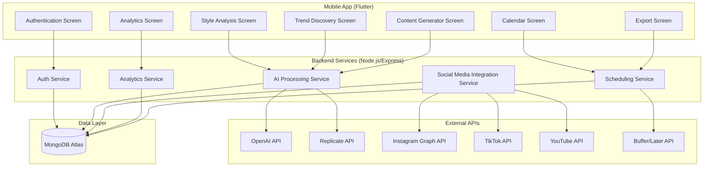

# Design Document

## Overview

The Social Media Creative Manager AI Agent is a cross-platform mobile application built with Flutter frontend and Node.js backend. The system leverages multiple AI APIs (OpenAI, Replicate, ElevenLabs) and social media platform APIs to provide comprehensive content creation and management capabilities. The architecture follows a microservices approach with clear separation between AI processing, social media integrations, and user management.

## Architecture

### High-Level Architecture



### Technology Stack

**Frontend:**
- Flutter 3.x for cross-platform mobile development
- Provider/Riverpod for state management
- HTTP package for API communication
- Shared Preferences for local storage
- Flutter Secure Storage for sensitive data

**Backend:**
- Node.js with Express.js framework
- JWT for authentication
- Mongoose for MongoDB integration
- Axios for external API calls
- Multer for file uploads
- Node-cron for scheduled tasks

**Database:**
- MongoDB Atlas for primary data storage
- Redis for caching (optional for performance)

**AI & External Services:**
- OpenAI GPT-4 for text generation and analysis
- Replicate for image/video processing
- ElevenLabs for voice cloning (future phase)
- Instagram Graph API for content analysis
- TikTok API for trend data
- YouTube Data API for video insights
- Buffer/Later APIs for scheduling

## Components and Interfaces

### Frontend Components

#### 1. Authentication Module
- **LoginScreen**: Email/password authentication
- **SignupScreen**: User registration with profile setup
- **ProfileScreen**: User profile management and settings

#### 2. Style Analysis Module
- **StyleUploadScreen**: Upload past content or paste descriptions
- **StyleProfileScreen**: Display analyzed style characteristics
- **MultipleProfilesScreen**: Manage different content styles

#### 3. Trend Intelligence Module
- **TrendFeedScreen**: Display filtered trending content
- **TrendDetailScreen**: Detailed trend analysis and metrics
- **RemixTrendsScreen**: Combine multiple trends into unique ideas

#### 4. Content Generation Module
- **ContentGeneratorScreen**: Main content creation interface
- **ScriptDetailScreen**: Full script with scene breakdowns
- **BatchGeneratorScreen**: Generate multiple content ideas
- **ContentPreviewScreen**: Preview generated content with all elements

#### 5. Calendar & Scheduling Module
- **CalendarScreen**: Visual content calendar with drag-drop
- **SchedulingScreen**: Set posting times and platform selection
- **ContentPillarsScreen**: Balance content types and themes

#### 6. Analytics Module
- **AnalyticsOverviewScreen**: Performance metrics dashboard
- **DetailedAnalyticsScreen**: Deep dive into specific content performance
- **AICoachScreen**: Weekly feedback and recommendations

#### 7. Export & Integration Module
- **ExportScreen**: Choose export formats and destinations
- **IntegrationScreen**: Connect external tools and platforms
- **CollaborationScreen**: Share content with team members

### Backend API Endpoints

#### Authentication Service
```
POST /api/auth/register
POST /api/auth/login
POST /api/auth/refresh
GET /api/auth/profile
PUT /api/auth/profile
```

#### AI Processing Service
```
POST /api/ai/analyze-style
POST /api/ai/generate-content
POST /api/ai/batch-generate
POST /api/ai/analyze-trends
POST /api/ai/reverse-engineer
```

#### Social Media Integration Service
```
GET /api/social/trends/instagram
GET /api/social/trends/tiktok
GET /api/social/trends/youtube
POST /api/social/connect-account
GET /api/social/user-analytics
```

#### Analytics Service
```
GET /api/analytics/performance
GET /api/analytics/engagement
POST /api/analytics/track-content
GET /api/analytics/ai-insights
```

#### Scheduling Service
```
POST /api/schedule/content
GET /api/schedule/calendar
PUT /api/schedule/update
DELETE /api/schedule/cancel
```

## Data Models

### User Model
```javascript
{
  _id: ObjectId,
  email: String,
  password: String (hashed),
  profile: {
    name: String,
    bio: String,
    niche: String,
    platforms: [String],
    timezone: String
  },
  styleProfiles: [{
    name: String,
    tone: String,
    voice: String,
    themes: [String],
    targetAudience: Object,
    visualStyle: Object
  }],
  connectedAccounts: [{
    platform: String,
    accountId: String,
    accessToken: String,
    refreshToken: String
  }],
  subscription: {
    plan: String,
    status: String,
    expiresAt: Date
  },
  createdAt: Date,
  updatedAt: Date
}
```

### Content Model
```javascript
{
  _id: ObjectId,
  userId: ObjectId,
  type: String, // 'generated', 'analyzed', 'scheduled'
  title: String,
  hook: String,
  script: String,
  sceneBreakdown: [Object],
  hashtags: [String],
  audioSuggestions: [Object],
  culturalReferences: [String],
  platforms: [String],
  scheduledFor: Date,
  performance: {
    views: Number,
    likes: Number,
    shares: Number,
    comments: Number,
    engagementRate: Number
  },
  trends: [ObjectId],
  styleProfile: ObjectId,
  status: String, // 'draft', 'scheduled', 'published'
  createdAt: Date,
  updatedAt: Date
}
```

### Trend Model
```javascript
{
  _id: ObjectId,
  platform: String,
  trendId: String,
  title: String,
  description: String,
  hashtags: [String],
  audioTrack: Object,
  metrics: {
    views: Number,
    uses: Number,
    growth: Number
  },
  niche: [String],
  relevanceScore: Number,
  expiresAt: Date,
  createdAt: Date
}
```

### Analytics Model
```javascript
{
  _id: ObjectId,
  userId: ObjectId,
  contentId: ObjectId,
  platform: String,
  metrics: {
    views: Number,
    likes: Number,
    shares: Number,
    comments: Number,
    saves: Number,
    engagementRate: Number,
    reachRate: Number
  },
  demographics: Object,
  timestamp: Date,
  createdAt: Date
}
```

## Error Handling

### Frontend Error Handling
- **Network Errors**: Retry mechanism with exponential backoff
- **Authentication Errors**: Automatic token refresh and re-authentication
- **Validation Errors**: Real-time form validation with user-friendly messages
- **API Errors**: Graceful degradation with offline capabilities
- **Loading States**: Skeleton screens and progress indicators

### Backend Error Handling
- **API Rate Limiting**: Implement rate limiting for external API calls
- **External API Failures**: Fallback mechanisms and cached responses
- **Database Errors**: Connection pooling and retry logic
- **Authentication Errors**: Proper JWT validation and refresh token handling
- **Validation Errors**: Comprehensive input validation with detailed error responses

### Error Response Format
```javascript
{
  success: false,
  error: {
    code: 'ERROR_CODE',
    message: 'User-friendly error message',
    details: 'Technical details for debugging',
    timestamp: '2024-01-01T00:00:00Z'
  }
}
```

## Testing Strategy

### Frontend Testing
- **Unit Tests**: Test individual components and utility functions
- **Widget Tests**: Test Flutter widgets and user interactions
- **Integration Tests**: Test complete user flows and API integration
- **Platform Tests**: Test on both iOS and Android devices
- **Performance Tests**: Memory usage and app startup time

### Backend Testing
- **Unit Tests**: Test individual functions and modules
- **Integration Tests**: Test API endpoints and database operations
- **Load Tests**: Test system performance under high load
- **Security Tests**: Test authentication and authorization
- **External API Tests**: Mock external services for reliable testing

### Test Coverage Goals
- Frontend: 80% code coverage
- Backend: 90% code coverage
- Critical paths: 100% coverage (authentication, payment, content generation)

### Testing Tools
- **Frontend**: Flutter Test, Mockito, Integration Test
- **Backend**: Jest, Supertest, MongoDB Memory Server
- **Load Testing**: Artillery or K6
- **Security Testing**: OWASP ZAP, Snyk

### Continuous Integration
- Automated testing on every pull request
- Deployment pipeline with staging environment
- Performance monitoring and alerting
- Security scanning in CI/CD pipeline

## Security Considerations

### Authentication & Authorization
- JWT tokens with short expiration times
- Refresh token rotation
- Role-based access control
- OAuth integration for social media platforms

### Data Protection
- Encryption at rest and in transit
- PII data anonymization
- GDPR compliance for user data
- Secure API key management

### API Security
- Rate limiting and throttling
- Input validation and sanitization
- CORS configuration
- API versioning and deprecation strategy

## Performance Optimization

### Frontend Optimization
- Lazy loading of screens and components
- Image caching and compression
- Efficient state management
- Bundle size optimization

### Backend Optimization
- Database indexing strategy
- Caching layer for frequently accessed data
- Connection pooling
- Asynchronous processing for heavy operations

### Scalability Considerations
- Horizontal scaling with load balancers
- Database sharding strategy
- CDN for static assets
- Microservices architecture for future growth